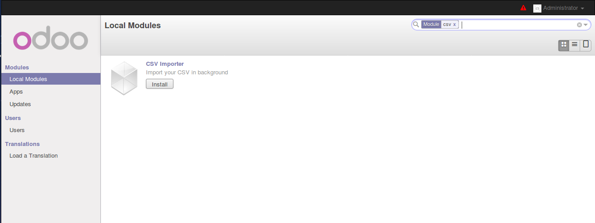
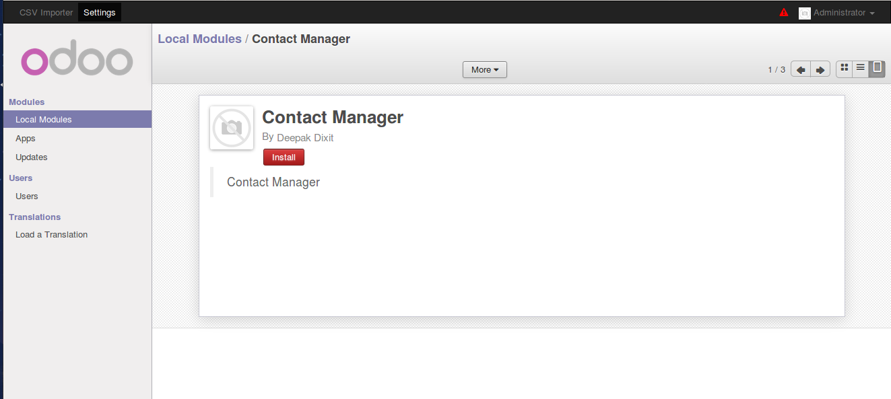
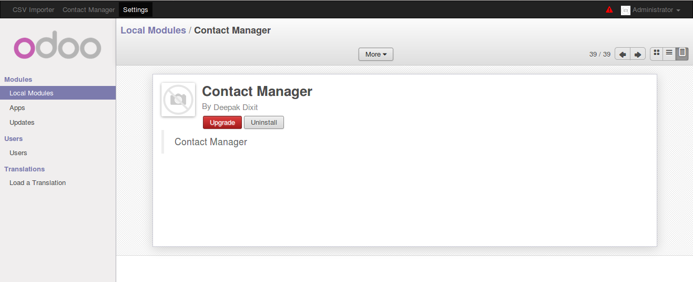
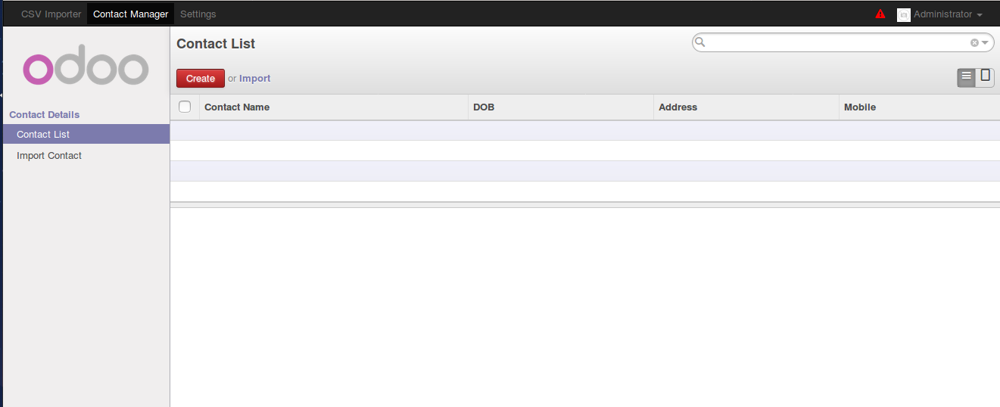
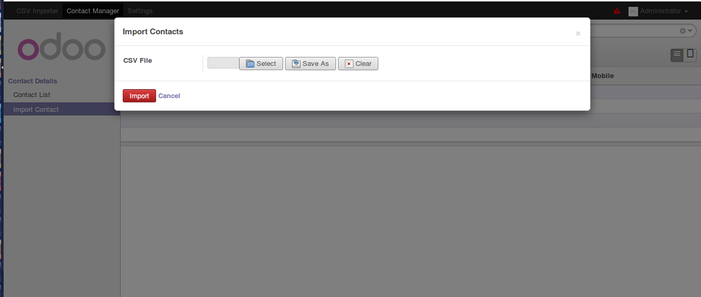
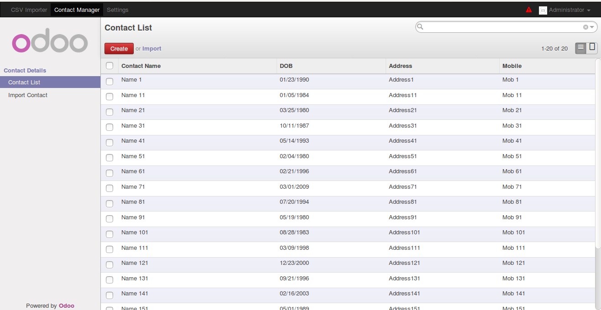
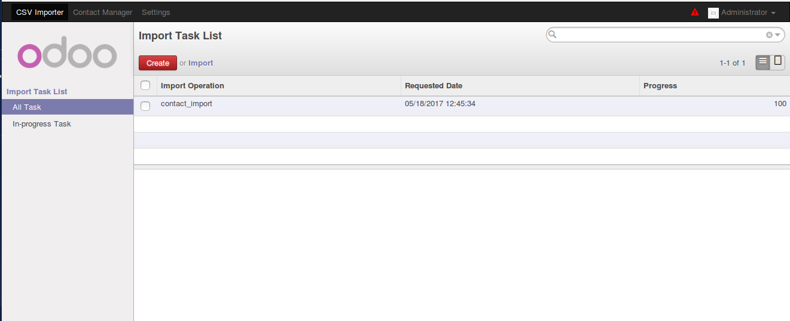

# CSV Importer

CSV Importer is converting your import operation into background operation only. So if you are using your own function for the validation purpose before import then only its useful for you.

Its not helpful if you are doing import operation using Odoo predefined import button .

## Getting Started

Suppose that you have a CSV file containing 5K records . Now if you will import it then it will take some time and until the completion of import operation you need to go for a cup of coffee. Here CSV Importer comes in the picture. It will convert your import operation into background process.

### Prerequisites

Odoo v8, tested on [OCB](https://github.com/OCA/OCB) also.

### Installing

You need to either clone it or you can also [download](https://github.com/SpiritualDixit/csv_importer/archive/master.zip) also and we are ready for installation.

This repo contains an example that how you can link your own module with it . You can find that example in **example** directory.

##### Install CSV Importer

Search module into local module list 



and install it


##### Install Contact Manager

Now CSV Imorter is installed into your Odoo modules . To check the usage we need to install either a simple Contact Manager or you can use your own module also. Lets install CSV Manager in same way . You can find source code of CSV Manager in example directory of this repo.




Install It -



Now we are ready to test the module 

## Execution Test

Its time to check our module execution .Click on Contact Manager menu  followed by Contact List



We can see that **Contact List** is empty . So lets import a CSV file by clicking on **Import Contact** menu . It will open a dialog box from which you can select the CSV. Lets use csv from **test/contact_list.csv**  and click on import button .



After import you can check the contact list and you will see that import has been done .



You can also see the list of import task using **CSV Importer** >> **All Task**




## Code Explaination 

Here we are using **CSV Importer** in Contact Manager module to import in background.

If you will look into Contact Manager model code then its will look like this :-


```
@api.multi
def do_import(self):
		
	csv_manager = self.env['csv.import.manager']
			
	csv_manager.initialize(
		import_operation = 'contact_import',
		import_data = self.csv_data, 
		db_cols_count = 5 , 
		validation_method = 'import_validator',
		caller_class = ContactImporter._name,
		debug = True
	)
	started = csv_manager.start_import()
```

We need to initialize the library first and then start the import process

* Create Object

```
csv_manager = self.env['csv.import.manager']
```
* Initialize 

```
csv_manager.initialize(
		import_operation = 'contact_import',
		import_data = self.csv_data, 
		db_cols_count = 5 , 
		validation_method = 'import_validator',
		caller_class = ContactImporter._name,
		debug = True
)
```

* Start Import

```
csv_manager.start_import()
```

### Documentation

**class CSVManager(openerp.models.Model)**

* This class will be used as an interface for developers to interact with this library .
* This is an Odoo model so developers can directly use their functions by creating the environment of it.

```
class CSVManager(models.Model):

    _name = "csv.import.manager"
    
    def initialize(self, import_operation , import_data, validation_method, caller_class, db_cols_count = 0, debug = None ):
    
        # Some Code
    
    def start_import(self):
    
        # Some code
```
#####  Methods Description :-
```
def initialize(self, import_operation , import_data, validation_method, caller_class, db_cols_count = 0, debug = None )
```

This function will be used to initialize the library with required parameters.

* import_operation    : [Required] A meaningful name for import operation like as 'import_contact'
* import_data         : [Required] Encoded csv data with 'cp850' followed by 'base64' (default in Odoo)
* validation_method   : [Required] Must be a function in caller_class
* caller_class        : [Required] Odoo model name i.e. _name 
* db_cols_count       : [Optional] Possible number of columns in CSV File
* debug               : [Optional] True to print debug message , False to keep silent

Example :-

```
class Example(models.Model):
    _name = "importer.example"
    def method_one (self, decoded_data, task_id):

        with api.Environment.manage():
            self.env = api.Environment( db_connect( self.env.cr.dbname ).cursor(), self.env.uid, self.env.context )
            # ... Import Code ...
            index = 0
            # ... Import Code ...
            for row in decoded_data:
                index +=1 
                # ... Import Code ...
            return True
```
Note:- We are using threading so validation function must be indented within api.Environment.manage() and should reinitialize     environment using api.Environment() .


**class CSVHolder(openerp.models.Model)**

* This class is responsible to do actual import operation.

```
class CSVHolder(models.Model):

    _name = "csv.import.holder"
    
    def update_task_progress(self, task_id, progress_counter):
        # Some Code
```
#####  Methods Description :-

```
def update_task_progress(self, task_id, progress_counter)
```
* It will update the import progress 

Example-

```
class Example(models.Model):
		
    _name = "importer.example"
    
    def method_one (self, decoded_data, task_id):
    
        with api.Environment.manage():
            self.env = api.Environment( db_connect( self.env.cr.dbname ).cursor(), self.env.uid, self.env.context )
            # ... Import Code ...
            index = 0
            csv_holder = self.env['csv.import.holder']
            # ... Import Code ...
            for row in decoded_data:
                 index +=1
                 # ... Import Code ...
                 csv_holder.update_task_progress(task_id, index )
                 # ... Import Code ...
            return True
```
